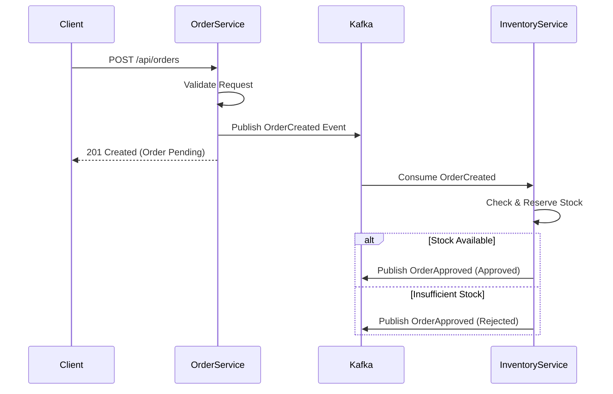

# Ecommerce Little

A microservices-based ecommerce application built with Spring Boot and Kafka, demonstrating Domain-Driven Design (DDD) principles.

## Architecture

The system consists of two main microservices that communicate asynchronously via Kafka:

1.  **Order Service**: Handles order placement.
2.  **Inventory Service**: Manages product stock and validates orders.

### System Flow



## Services

| Service | Description | Port |
|---------|-------------|------|
| [Order Service](./order-service/README.md) | Manages order lifecycle and publishes events. | 8080 |
| [Inventory Service](./inventory-service/README.md) | Consumes order events and manages inventory. | 8081 |

## Prerequisites

- **Java 17**: Required for running the services.
- **Maven 3.6+**: For building the projects.
- **Kafka**: Must be running on `localhost:9092`.

## Getting Started

1.  **Start Kafka**: Ensure your local Kafka instance is up and running.
2.  **Start Order Service**:
    ```bash
    cd order-service
    ./mvnw17.sh spring-boot:run
    ```
3.  **Start Inventory Service**:
    ```bash
    cd inventory-service
    ./mvnw17.sh spring-boot:run
    ```

## API Documentation

- **Order Service Swagger**: [http://localhost:8080/swagger-ui.html](http://localhost:8080/swagger-ui.html)
- **Inventory Service Swagger**: [http://localhost:8081/swagger-ui.html](http://localhost:8081/swagger-ui.html)
